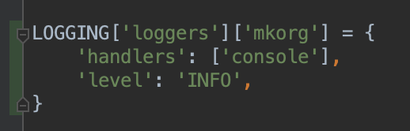

# Debugging

* Scientific Approach to Debugging
* Debugging Aids
* Writing Debuggable Code

---

class: center, middle

# Scientific Approach to Debugging

---

## Verify bug and determine correct behaviour

1. Is there actually a bug?
2. Do we understand what the system should have done?

---

## Reproduce and Isolate

#### Reproduce

Have a set of inputs which reliably produce the bug

#### Isolate

Know the subset of inputs for which the bug occurs

???

* Why reproduce?
  * So that we know that a fix works
  * Usually the first fix doesn't work -- you need to try multiple things

* Issue
  * Some users are not able to login
  * Can you reproduce the issue reliably?
    * Using your own login
    * In your test environment
    * Can you go over to the user and check?
  * Look for common factors in all the users facing this issue:
    * Maybe they were users who signed up recently
    * Maybe they are trying to login from the same region

* Issue
  * Users are not able to login just before midnight
  * To reproduce
    * Reset system clock to just before midnight and check

---

## Guess where the bug might be

* Is it in your code?
* In a framework or library you are using?
* In your compiler or OS?

---

## Guess where the bug might be

* Is it in your code? **(90-95% of the time, yes!)**
* In a framework or library you are using? **(5-10% of the time)**
* In your compiler or OS? **(< 1%)**

---

## Run experiments

---

## Fix and verify

---

## Write a regression test

* Unit tests
* Functional tests

---

## Undo changes

* Print statements
* Config changes
* Destroy test environment, db, etc.

---

## Find related bugs

Save time before the bug manifests itself again

---

class: center, middle

# Debugging Aids

---

## Print statements

---

## Print statements

---

## Print statements

---

## Logging

---

## Logging

---

## Log levels

---

## Log levels

---

## Log handlers

Choose where to send logs and at what level:

* Console
* File
* Syslog
* Email
* etc.

---

## Log handlers

---

## Debugger

---

## Automate

* Scripts
* Unit tests
* Selenium, etc. for web frontend stuff

---

## git blame

Who changed this line?

---

## git bisect

When was this bug introduced?

???

https://www.youtube.com/watch?v=P3ZR_s3NFvM

---

class: center, middle

# Writing Debuggable Code

---

## Logging

* Make extensive use of logging
* Use appropriate levels
* Collect logs at one place

---

## Send stack traces somewhere

* Sentry, etc.

---

### Version control hygiene

* Commit only one logical change at a time
* Write descriptive commit messages

---

## Add a way to view the program's state while running

* In memory
* Database
* Cache

---

## Code hygiene

* Validate your inputs -- catch bugs early, catch them often
* Single Responsibility Principle
* Shared state, global variables, side effects (especially global variables)
* clean and convention compliant code
 because while debugging we do read code. Comments for all important
 decision points of the code.
* pieces of your system (as much as possible) should be testable in isolation.
  This is possible if they do not depend on global state but only on
  input parameters
* IO functionality should be separate from core logic.
* Document stuff
